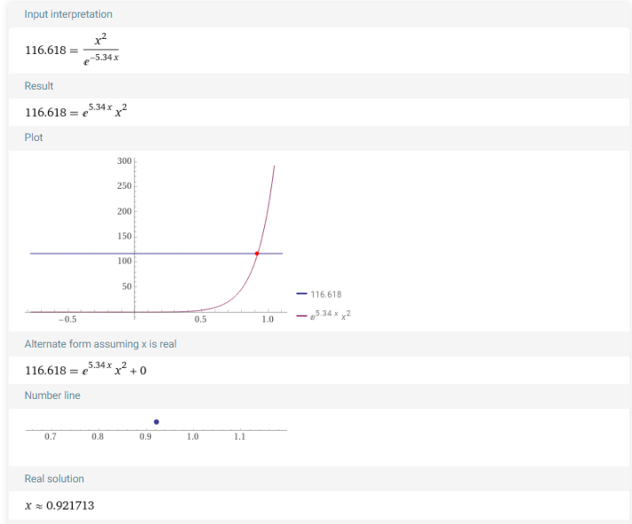
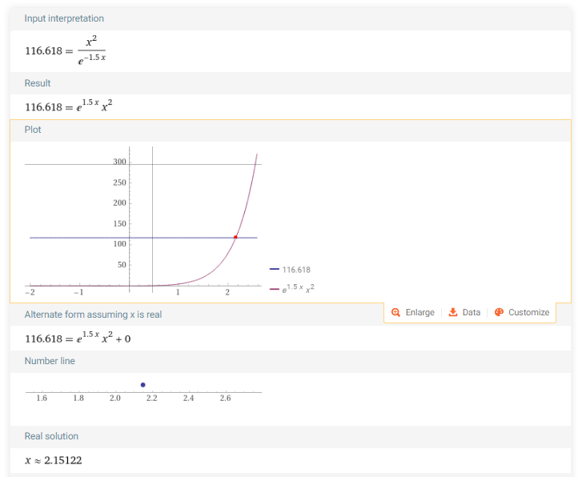
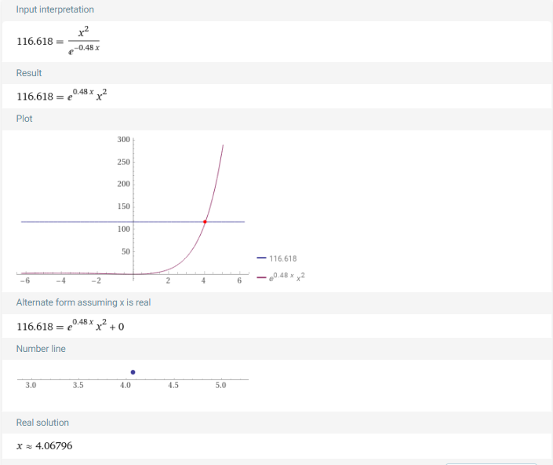

<head>
  
  
</head>

## Songhui Wang

### Assignment 2

1. Due to $2\rho _0\gt 2\rho _L$ and object is a flat mirror reflector:

   $$\Phi _L = \frac{16\rho ^2 \Phi _R R_m^2}{k_1 \eta _1 \eta _2 \eta _3 \tau _{\sigma} (2R_ m)\rho _s D^2}$$

2. Substitute the known data,get the equation:

   $$116.618=\frac{R _m^2}{\tau _{\sigma} (2R_ m)}$$

3. Replace  $\tau_\sigma (2R_m)$ with $e^{-2 \sigma_m R_m}$ 
   
   $$116.618=\frac{R _m^2}{e^{-2 \sigma _m R_m}}$$

4. Calculate $\sigma _m$

$$ q= \begin{cases}
    0.585(R_v)^{3/2}, R_v \lt6km\\
    1.3, R_v \gt6km
\end{cases}$$

$$\sigma _m = \frac{3.192}{R_v}(\frac{0.55}{\lambda})^q$$

$$q=\begin{cases}
    0.585,R_v=1.0\\
    0.844,R_v=3.0\\
    1.3,R_v=7.0
\end{cases}$$

$$\sigma _m=\begin{cases}
    2.67,R_v=1.0\\
    0.75,R_v=3.0\\
    0.24,R_v=7.0
\end{cases}$$

5. Solve the equation
   
$$R_v=1.0 \rightarrow 116.618=\frac{R_m ^2}{e^{-5.34R_m}} \rightarrow R_m=0.922 $$

$$R_v=3.0 \rightarrow 116.618=\frac{R_m ^2}{e^{-1.5R_m}} \rightarrow R_m=2.15  $$

$$R_v=7.0 \rightarrow 116.618=\frac{R_m ^2}{e^{-0.48R_m}} \rightarrow R_m=4.068  $$

